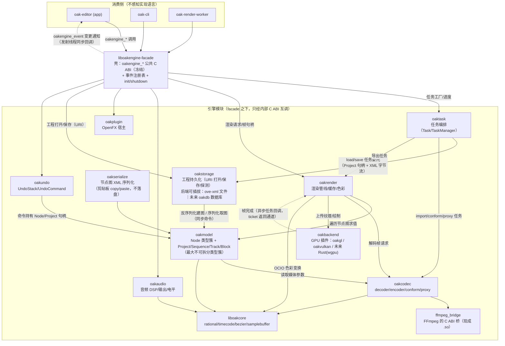

# RIIR 绞杀者模式执行计划：liboakengine 模块化拆分与渐进式 Rust 重写

> 本文档描述在 C ABI 迁移战役（见 `completed/c-abi-migration-handoff.md`）完成之后，
> 如何用绞杀者模式（Strangler Fig）把 liboakengine.so 安全地拆成若干小模块，
> 再逐个重写为 Rust。
> **核心约束：每一步都可验证、可回退；任何一步失败都不影响已验证的部分。**
>
> 本文档面向未来的执行者（可能没有本文写作时的对话上下文），因此关键决策、
> 依据和验证方法都写成自包含的形式。与交接文档的关系：交接文档管"ABI 迁移战役"
> （消灭 oak-editor 对 olive:: 的引用、liboakengine 只导出 oakengine_*），
> 本文档管那之后的"拆分与重写战役"。**拆分的前置条件是 ABI 迁移完成（§1.1）。**

---

**API 冻结保证（最高优先级约束，先于一切拆分）**

**拆分模块，但公共 API 一个不动。** 这是整个战役的硬约束，凌驾于任何
"拆得更细"的冲动之上。三条钉死：

1. **公共 `oakengine_*` 全程冻结。** 在整个拆分与 Rust 重写期间，
   `engine/include/oakengine/*.h` 里的每个公开函数：不改签名、不删函数、
   不改语义。唯一允许的变更是**新增**函数，且必须标注 experimental。
   新增不等于变更——既有签名与语义一个字都不许动。
2. **`liboakengine-facade` 自身不拆分。** facade 是唯一、薄、稳定的路由层，
   公共 `oakengine_*` 全部保留在这里。拆分发生在它**之下**：facade 的内部
   实现从"直接调 C++"改为"转发给对应小库的 C ABI"，但**对外暴露的符号表
   与调用约定完全不变**——app / oak-cli / render-worker / 未来 AI Agent
   只链接 facade，连重新链接都不用。
3. **模块间内部 C ABI 与公共 API 分层、分别版本化。** 拆分后模块之间
   （如 oakrender 调 oakmodel）不能再 C++ 直连，必须走**新增的内部 C ABI**。
   这层接口：(a) 只对模块间可见，app 永远看不到；(b) 与公共 API 分开管理、
   允许演进；(c) 命名与头文件路径必须明显区别于公共 facade（例如放
   `engine/include/oakinternal/`，前缀 `oakinternal_`），杜绝"内部接口慢慢
   变成事实公共 API"的漂移。公共 `oakengine_*` 另加**版本字段**
   （`oakengine_api_version()`），让任何公共面的意外漂移可被检测。

> 一句话：**缝（公共 facade）冻死，缝后面的实现随便拆随便换。**
> 任何执行步骤如果会改动公共 `oakengine_*` 的既有签名或语义，就是走错了，
> 停下来回到本节。

---

## 0. 为什么这条路是可行的（三个已验证的事实）

1. **绞杀缝已经存在。** 迁移战役的最终产物就是一条稳定、纯 C、带测试覆盖的
   ABI 缝（`engine/include/oakengine/*.h`，~30 个头、20+ 族）。绞杀者模式最危险
   的一步——"在没有缝的系统里造缝"——已经由当前战役完成。
2. **插件模式在本仓库已跑通。** `ffmpeg_bridge`（独立 .so，C ABI）、
   `oakgl`/`oakvulkan`（渲染后端插件，经 `engine/render/backend/renderbackend_c.h`
   的 C ABI 由 `DynamicRenderer` 动态加载）证明"小 .so + C ABI + 运行时替换"
   在本代码库不是理论，是现状。本计划只是把同一模式推广到全引擎。
3. **验证资产现成。** 44+ ctest、~2000 条 gtest、oak-cli（info/probe/render/
   transcode，含 PPM 帧输出）、worker 端到端 harness（NDJSON 协议真实渲染）、
   测试素材（demo.mp4/img.png/project_with_footage.ove）。每一步验证不需要
   新建测试体系，只需要把它们固化为"门禁脚本"。

---

## 1. 目标、前置条件与非目标

### 1.1 前置条件（未满足前不动工）

- ABI 迁移战役完成：oak-editor / oak-render-worker `U _ZN5olive` = 0；
  `nm -D --defined-only liboakengine.so | grep -c " T _Z"` = 0（visibility 收口）；
  全量 ctest 绿。（即交接文档 §1 的四条验收。）
- 本文 §4.2 的基础设施（Rust 工具链接入 + 门禁脚本）就位。

> **R6 收尾状态（2026-07-26 实测）**：
> - ✅ oak-editor / oak-render-worker `U _ZN5olive` = **0**（R5→R6 迁移战役完成，
>   nm 58→0；交接文档 §6.4 豁免清单已清空为"无豁免"）；
> - ✅ 全量构建 0 error、全量 ctest 绿（45/45）；app↔engine 边界对 app 的
>   引用而言已是纯 C ABI——**"边界已纯"**。
> - ⏳ **遗留项（不属 R6 范围，S0 需复核）**：engine 侧 visibility 收口未做——
>   `nm -D --defined-only liboakengine.so | grep -c " T _Z"` 实测 = **3486**
>   （导出 C++ 符号），尚未降到 0。该子条件是独立的收口工作（§2 Step 2 的
>   visibility=hidden 规则），app 侧已无任何引用，收口不影响 app。
> - 已知遗留（已论证，不泄漏符号）：app 仍 include 约 40 个 engine C++ 头
>   （node/render/timeline/undo/pluginSupport，用于类型与 inline 访问器），
>   nm=0 证明不产生符号引用；彻底清理超出 R6 的 58 符号目标，留待后续批次。

### 1.2 终态

- `liboakengine.so` 不复存在，取而代之的是一组小动态库（§3 模块图），
  每个只有两种实现状态：C++（待重写）或 Rust（已重写）。
- app/worker/cli 只链接 **facade 壳库**（`liboakengine-facade`），对下层模块
  的实现语言无感知。
- 任何模块的 Rust 替换都经过 §2 的六步流程，全程有 C++ 版本可回退，
  直到 G6 退役门禁通过。

### 1.3 非目标（明确不做）

- 不重写 Qt、FFmpeg、OpenColorIO、PortAudio 等第三方库本身。
- 不重写 app（UI 层保持 C++/Qt；它消费的本来就是 C ABI）。
- 不改变 `oakengine_*` 公开 facade 的任何既有签名（拆分/重写只许改实现，
  不许动契约；新增内部 ABI 允许，但必须符合同一套头文件规则）。
- 不做 big-bang：任何时刻整个系统都必须可构建、可测试、可发布。

---

## 2. 绞杀六步（每个模块的统一流程）

对每一个模块 X，严格按以下顺序执行；每步有对应门禁（§5），不过门禁不进下一步。

### Step 1 — 冻结 ABI
- 评审模块对外 C ABI 头（公开 facade 已有部分直接复用；模块间内部调用需要的
  新增内部头，按 `completed/c-abi-migration-handoff.md` §6.1 的同一套规则写：纯 C 类型、
  buf/size 约定、owned/borrowed 注释、错误码）。
- 用门禁脚本生成 ABI 快照（§5-G1）并入库。**此后该头的任何改动都是显式评审行为。**

### Step 2 — 物理拆分（C++ 实现原样搬出）
- 新建 `liboakengine-<X>.so`：把该模块源码从 liboakengine 移入独立 CMake 目标；
  原引擎内其他部分对它的 C++ 调用**全部改走它的 C ABI**。
- 新库同样 visibility=hidden + 只导出 C 符号。
- 过 G2：构建绿、全量 ctest 绿、符号审计绿、ABI diff = 0。
- **此步不改任何行为**——只搬代码和改调用方式。发现行为必须改才能拆的，
  停下来记录，先回去补 facade（回 Step 1）。

### Step 3 — Rust 影子实现
- `rust/<X>/` 建 cdylib crate，实现与 Step 1 完全相同的 C ABI。
- cbindgen 生成的头与 C++ 头做规范化 diff（§5-G3），必须一致。
- FFI 边界硬规则：`catch_unwind` 全包裹（panic 不得跨 FFI）、错误码语义逐条
  对齐、owned/borrowed 生命周期按注释实现（`Box::into_raw` / 借用引用）、
  回调线程语义按契约复现（见 §6.2）。

### Step 4 — A/B 双跑
- CMake 选项 `OAK_MODULE_<X>_IMPL=cpp|rust` 控制链接哪个实现。
- 两种配置各自全量构建 + 全量 ctest + 金标准对比（§5-G4）。
- **帧级一致**：渲染输出字节一致或 PSNR ≥ 50dB；**序列化 round-trip 字节一致**；
  其余以测试断言为准。

### Step 5 — 切换默认实现
- 默认实现切到 rust；CI 三平台构建 + 全量测试。
- C++ 实现保留一个发布周期作为回退选项（option 切回即可）。

### Step 6 — 退役
- 删除该模块的 C++ 实现与 cpp 构建分支；ABI 快照锁定为最终态；全量回归（G5 同项）。
- 在 roadmap 记录该模块重写完成。

---

## 3. 模块图与拆分顺序

### 3.1 依赖方向（单向，禁止循环；上层只经下层 C ABI 调用）

```
        app / oak-cli / oak-render-worker
                     │
            liboakengine-facade（壳：capi + 事件 + init）
                     │
   ┌────────┬────────┼─────────┬──────────┬──────────────┐
 oaktask  oakrender  oakplugin  oakaudio  oakserialize  oakstorage
   │        │         │          │          │            （工程文件读写，
   └────────┴────┬───┴──────────┴──────────┘            独立模块，未来
                 │                                        替换为数据库）
        oakmodel（节点图 + 项目模型 + 时间线模型）
                 │
        ┌────────┼─────────┐
     oakcodec  liboakcore  oakbackend（GPU 插件：oakgl/oakvulkan/未来的 Rust 后端）
        │
   ffmpeg_bridge（已是 C ABI .so）
```

**oakstorage 单列说明（本计划对原模块图的唯一结构性修改）**：
工程文件的读写（`node/project/serializer` 的落盘路径 + `task/project/`
load/save/loadotio/saveotio 的文件 IO）从 oakserialize / oaktask 中**单独拆出**为
oakstorage 模块。它对上只暴露**存储后端无关**的 C ABI（打开/保存/探测工程，
URI 寻址），当前唯一后端是 XML .ove 文件；**未来替换为数据库时只新增一个
后端实现，上层（oaktask/facade）零改动**。剪贴板序列化（copy/paste）不属于
存储，仍留在 oakserialize。详细接口设计见 `riir/04-interfaces.md` 与
`riir/M10-oakstorage.md`。

### 3.1.1 模块数据流图（Mermaid）

下图描述终态各模块之间的调用与数据流向。**实线 = 命令调用（上层→下层，
内部 C ABI `oak<mod>_*`，调用方知道影响）；虚线 = 仅两种允许的反向通知：
facade→app 的 `oakengine_event` 通道，以及异步任务（oaktask 任务 /
渲染 ticket / GPU 帧完成）的完成回调。下层对上层没有事件订阅。**



**数据流要点**：

1. **命令流（自上而下）**：app 的每个动作 → facade `oakengine_*` → 对应
   模块内部 C ABI。facade 是唯一入口，模块不允许被 app 直接链接。
2. **工程 IO 流**：`oaktask` 创建 load/save 任务 → 委托 `oakstorage`；
   oakstorage 按 URI scheme 选后端（`file://*.ove` → ove-xml 后端，
   未来 `oakdb://` → 数据库后端），序列化/反序列化时对 `oakmodel` 建图
   取图。**替换为数据库只发生在 oakstorage 内部。**
3. **帧数据流**：`oakcodec` 经 `ffmpeg_bridge` 解码 → `oakrender` 遍历
   `oakmodel` 节点图求值 → `oakbackend`（GPU 插件）上屏/导出；帧以不透明
   句柄 + buf/size 约定跨边界，不传递 C++ 对象。
4. **通知流（仅两种反向通道，虚线）**：模块间没有事件订阅——上层调
   下层只有命令，调用方知道影响；变更通知由命令发起层（通常是 facade）
   经 `oakengine_event` 同步回调给 app，Rust 化后只是发射端换语言，
   通道不变（§6.1）。另一例外是异步任务的完成回调（oaktask 任务、
   渲染 ticket、GPU 帧完成）——回调即该异步命令的返回通道。
5. **undo 流**：所有可撤销编辑（无论来自 facade 还是模块内部）都包装成
   `OakUndoCommand` 进入 `oakundo` 栈，命令体内只持 oakmodel 句柄。

**关键架构事实（拆分顺序的依据）**：
- `Node` 及其子类簇（Project/Folder/Footage/Sequence/Block/Track/Clip/Gap/
  Transition/Subtitle/各效果节点）是 C++ 继承绑死的**不可拆分类型簇**——
  跨模块做 C++ 继承不可能不导出 C++ 符号。因此它们必须整体作为一个模块
  （oakmodel）处理，重写时也作为一个重写单元。这是本计划最大的一个拆分
  粒度结论，不要再试图把 Block/Track 从 Node 里拆出去。
- `oakcore`（liboakcore.so）已是纯 C ABI 独立库，是天然的第一块 Rust 试验田
  （见 M0）。
- GPU 后端已是插件，重写线与主线解耦（见 §7）。

### 3.2 执行顺序（依赖最少、Qt 最少、验证最容易的在前）

| 批次 | 模块 | 内容 | 前置依赖 | 主要风险 |
|---|---|---|---|---|
| M0 | **oakcore** | liboakcore 整体（rational/timecode/bezier/samplebuffer/audioparams，Qt-free） | 无 | 极低；工具链试金石 |
| M1 | **oakaudio** | AudioProcessor、AudioSynchronizer、AudioLevelMeter、波形计算 | oakcore | 低；顺带消掉 AudioProcessor 豁免项 |
| M2 | **oakcodec** | decoder/encoder/conform/proxy | ffmpeg_bridge | 中；FFmpeg 行为复刻 |
| M3a | **oakstorage** | node/project/serializer 落盘路径 + task/project/{load,save,loadotio,saveotio} 文件 IO（工程持久化，后端可插拔：当前 XML 文件，未来数据库） | oakmodel（经 facade node/project 族） | 中；round-trip 必须字节一致；后端接口一次冻结 |
| M3b | **oakserialize** | node/project/serializer 的剪贴板/节点图 XML 序列化（copy/paste，不落盘） | oakmodel（经 facade node/project 族） | 中；round-trip 必须字节一致 |
| M4 | **oakundo** | UndoCommand/UndoStack/MultiUndoCommand | oakmodel（经 facade） | 中；全局调用点多 |
| M5 | **oakrender** | RenderManager/ticket/watcher/cache/PreviewAutoCacher/ColorProcessor | oakmodel、oakcodec | 高；线程与 OCIO |
| M6 | **oakmodel** | Node/NodeInput/keyframe/traverser/factory/Project/Folder/Footage/Sequence/Block/Track/效果节点 | oakcore、oakcodec | 最高；最大类型簇 |
| M7 | **oaktask** | Task/TaskManager 及各任务类型 | oakmodel、oakrender | 中；QtConcurrent |
| M8 | **facade 壳 + 收尾** | capi 各实现、事件注册表、coreengine、config、plugin(OFX) | 全部 | 中；事件机制 Rust 化 |

每个批次内部都走 §2 的六步。**严格串行**：上一批次 G5 完成才开下一批次
（M0 例外，可与 ABI 迁移战役收尾并行准备）。

**为什么 oakmodel 排第六而不是第一**：它是依赖中心，先拆它会导致所有模块
都要先等它的内部 ABI 定型；先拆叶子模块可以用公开 facade（node.h/project.h/
timeline.h，本就是为外部消费设计的）充当模块间缝，缝的质量先被实战检验，
最后拆 oakmodel 时它的对外接口已经是稳定态。

---

## 4. 阶段计划

### 4.1 阶段 S0：前置确认（0 成本，只是检查）
- 对照 §1.1 逐条核对 ABI 迁移战役验收结果。未完成则停止，回到交接文档。

### 4.2 阶段 S1：重写基础设施（第一批真正的活）
1. **Rust 工具链接入**：仓库根建 `rust/` workspace；CMake 集成用 Corrosion
   （cmake+cargo 标准方案）；`cargo`/`cbindgen` 版本锁定并写进构建文档。
   禁止要求全局安装 cargo 之外的 Rust 组件（CI 可复现）。
2. **门禁脚本固化**（全部进 CI）：
    - `scripts/abi-dump.sh`：对每个相关 .so 导出 `oakengine_*`/`oakcore_*` 符号 +
      头文件规范化哈希，产出快照文件；`scripts/abi-check.sh` 与入库快照 diff。
    - `scripts/golden-render.sh`：oak-cli render demo.mp4 指定帧 → PPM，
      与金标准比对（字节一致或 PSNR ≥ 50dB）；`oak-cli transcode` PPM 同理；
      project_with_footage.ove 序列化 round-trip 字节一致；worker E2E harness。
    - `scripts/symbol-audit.sh`：现有 nm 三件套的脚本化（app 侧 `U _ZN5olive`、
      各 .so `T _Z`、facade 测试覆盖审计）。
3. **M0：liboakcore Rust 重写**（试点）。完整走六步，目的是把工具链、A/B 流程、
   门禁全部打通并暴露问题。它是全仓库最小最干净的模块，失败成本最低。
   M0 没全绿之前，不允许排产任何后续模块。

### 4.3 阶段 S2–S8：M1–M8
按 §3.2 表格逐模块执行。每模块的"模块档案"（边界清单、Qt 依赖清单、
信号清单、线程语义、验证重点）在 Step 1 时补写到本文 §6 对应小节。

---

## 5. 验证门禁（每步必须过，脚本化、进 CI）

| 门禁 | 触发步 | 内容 | 通过标准 |
|---|---|---|---|
| G0 | 每批开始 | 全量构建 + 全量 ctest + golden-render 基线快照 | 全绿，快照入库 |
| G1 | Step 1 | abi-dump 快照 | 与上一基线 diff 仅含本批新增 |
| G2 | Step 2 | 构建 + 全量 ctest + 新库符号审计 + ABI diff | 全绿；新库导出仅 C；diff=0 |
| G3 | Step 3 | cbindgen 头 vs C++ 头规范化 diff；crate 单测 | diff=0；单测全过 |
| G4 | Step 4 | 双实现配置各自全量测试 + golden 对比 | 两轮全绿；帧/序列化一致 |
| G5 | Step 5 | 三平台构建 + 全量测试 + 性能抽测 | 全绿；渲染帧耗时回退 ≤10% |
| G6 | Step 6 | 删除 C++ 实现后全量回归 + ABI 快照锁定 | 全绿；快照入库 |

- **性能抽测**：golden-render 脚本记录渲染耗时，Rust 版慢于 C++ 版 10% 以上
  必须查明原因（允许记录后放行，但不允许无声劣化）。
- **回退规则**：任何门禁失败 → 停止该模块，切回 cpp 实现（Step 4 之后才有
  可切对象；之前是天然回退态），记录原因，系统保持全绿。

---

## 6. 跨模块设计约束（全部钉死）

### 6.1 信号/通知的 Rust 化
- engine 的 QObject 信号是当前变更通知机制；capi/events.cpp 用 `dynamic_cast`
  校验订阅 handle 的族类型。**Rust 对象没有 dynamic_cast**，因此在 M5（oakmodel
  前置）之前必须引入**句柄类型标签约定**：所有 facade 句柄指向的对象首字段为
  `uint32_t type_tag`（枚举值入 ABI 头），events.cpp 的族校验改为读标签。
  这是对 events.cpp 的授权内改动，需配事件实测用例。
- Rust 模块的变更通知：经同一张 oakengine_event 注册表发射（事件机制是
  app 侧唯一通道，Rust 模块只是换了发射端的实现语言）。

### 6.2 线程语义（ABI 契约，Rust 必须逐条复现）
- facade 回调/事件 = 发射线程同步调用（Qt::DirectConnection 等价），引擎对象
  属 GUI 线程；回调内不得反调改同一对象的编辑原语。
- 渲染在后台线程（当前 QtConcurrent）；Rust 侧线程模型自选（std::thread/
  rayon/自建池），但**回调触发线程与顺序语义必须与原实现一致**；worker
  NDJSON 协议的线程行为不得改变。
- 每模块 Step 1 时必须把该模块涉及的线程归属写进模块档案。

### 6.3 内存与生命周期
- owned/borrowed 规则按各 facade 头注释执行；Rust 侧 owned 句柄 `Box::into_raw`，
  free 函数 `Box::from_raw` 回收；borrowed 句柄不接管析构。
- 禁止在 FFI 边界传递任何 Rust 特有类型（String/Vec/ trait object）；边界上只有
  C 类型，与现有头文件规则相同。

### 6.4 错误与 panic
- panic 不得跨 FFI（`catch_unwind` 全包裹，映射为 `OAKENGINE_E_FAILED` +
  last_error 字符串）。错误码语义与 C++ 实现逐条一致（A/B 对比时断言）。

### 6.5 全局单例
- Config/NodeFactory/RenderManager/AudioManager 等单例，Rust 侧用 `OnceCell`/
  显式注册表实现；初始化/销毁时机挂在 `oakengine_init`/`oakengine_shutdown`
  既有钩子上，不引入新的隐式初始化。

### 6.6 第三方库
- FFmpeg：继续经 `ffmpeg_bridge`（已是 C ABI），Rust 模块链接桥库而非直接绑 FFmpeg。
- OCIO：ColorManager 是 C++ API 重度用户，M5 时评估：薄 C 封装进 facade vs
  保留 C++ 微库长期共存（允许作为长期 C++ 孤岛，写入 roadmap）。
- Qt：只允许 facade 壳与 app 侧使用；M1 起的各引擎模块实现内**不得新增 Qt 依赖**
  （QtCore 容器可暂用，但不得新增 QObject 信号、moc 类）。

---

## 7. GPU 后端平行线

- oakgl/oakvulkan 已是 `renderbackend_c.h` C ABI 插件，与主线解耦。
- Rust 后端（建议 wgpu 起步）作为**新插件**并行开发，通过同一 ABI 被
  DynamicRenderer 加载；验收用现有 Backends gtest（Vulkan 用例即现成的
  A/B 对比器——同一测试分别加载两个后端跑）。
- 不替代主线任何模块门禁；独立排期，不阻塞 M1–M8。

---

## 8. 风险登记册（开工前评审，施工中持续更新）

| 风险 | 等级 | 对策 |
|---|---|---|
| oakmodel 类型簇过大，六步周期过长 | 高 | Step 2 允许分子批拆分（先项目模型后效果节点），但 ABI 一次冻结 |
| 线程语义偏差导致偶发黑屏/崩溃 | 高 | G4 双跑必须包含 worker E2E 与 Backends viewer 用例；引入压力重复（每用例 ×10） |
| OCIO 无法 Rust 化 | 中 | 允许 C++ 孤岛（§6.6），不影响其他模块 |
| QtConcurrent 行为差异 | 中 | M5/M7 档案逐条记录并发模式；A/B 含并发压力 |
| cbindgen 头漂移 | 中 | G3 规范化 diff 进 CI，漂移即红 |
| 构建复杂度（cargo+cmake）拖慢迭代 | 中 | Corrosion 单一入口；文档固化；禁止手工 rustc |
| 行为不可拆（Step 2 发现必须改行为才能拆） | 中 | 回 Step 1 补 facade； roadmap 记录；禁止带行为变更进 Step 2 |
| 性能劣化 | 低 | G5 抽测阈值；剖析后放行或回退 |

---

## 9. 里程碑摘要（可直接抄进项目计划）

1. **S1 完成**：Rust 工具链 + 门禁脚本进 CI；M0（liboakcore）G6 退役。
2. **M1–M2 完成**：音频 DSP 与编解码 Rust 化；AudioProcessor 豁免项消除。
3. **M3a–M4 完成**：工程存储（oakstorage，含后端可插拔接口冻结）、剪贴板
   序列化与 undo Rust 化；项目文件 round-trip 金标准常青。
4. **M5 完成**：渲染管线 Rust 化（OCIO 孤岛与否已裁决并记录）。
5. **M6 完成**：oakmodel Rust 化——**最大里程碑**，此后 liboakengine 主体为 Rust。
6. **M7–M8 完成**：任务系统与 facade 壳 Rust 化；liboakengine.so（C++ 版）正式退役。
7. **GPU 平行线**：Rust 后端插件经 Backends 双后端测试验收。
